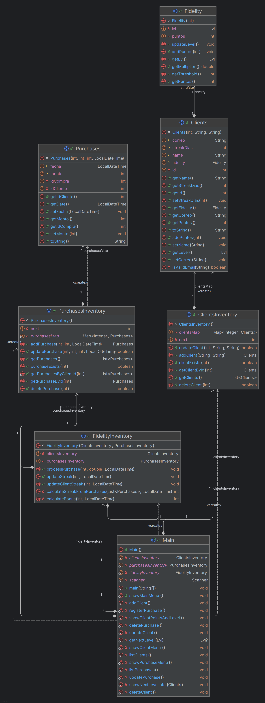
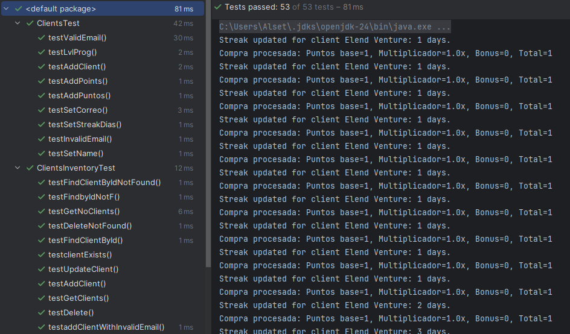
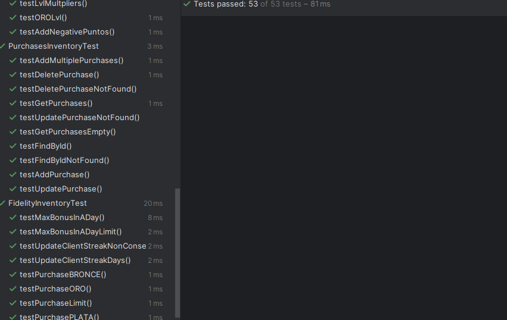
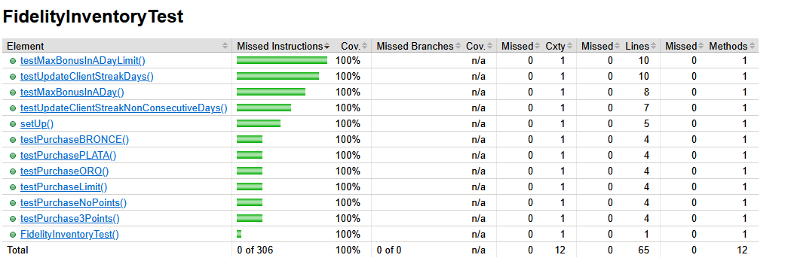
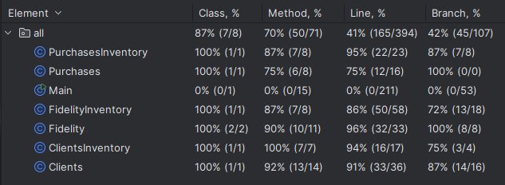
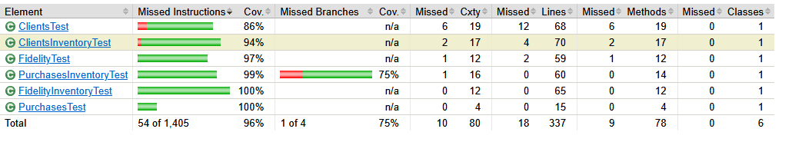

# 📦 Descripción del Diseño

Separamos el código en clases principales y clases inventario. Como se puede ver en el diagrama, por ejemplo:

- `Purchases` contiene la lógica de una compra individual.
- `PurchasesInventory` gestiona la lógica general relacionada con el conjunto de compras.

En `Main` se encuentra toda la lógica del menú interactivo a través de línea de comandos.

---

# ▶️ Cómo Ejecutar

1. Abrir el proyecto en **IntelliJ IDEA**.
2. Ejecutar el archivo `Main` con el botón **Run**.

### Para correr los Unit Tests:
- Dirigirse al directorio `test/java`.
- Ejecutar los archivos `ClaseTest.java` correspondientes a cada clase para correr las pruebas unitarias por módulo.

### Para correr todos los tests y generar el reporte con JaCoCo:
1. Ubicarse en el directorio de pruebas dentro de IntelliJ IDEA.
2. Seleccionar la opción:  
   **"More Run/Debug" → Run 'tests in Java' with Coverage**  
3. Asegurarse de seleccionar **JaCoCo** como herramienta de cobertura.
4. El reporte será generado dentro de IntelliJ IDEA y se podrá exportar.

---

# ✅ Ejemplo de Ejecución de Unit Tests

  

---

# 📊 Cobertura de Código

### Reporte en IntelliJ IDEA

### Reporte con JaCoCo

  

Se midió tanto:
- **Cobertura de instrucciones (statement coverage)**: a través del conteo de instrucciones no ejecutadas (`Missed Instructions`).
- **Cobertura de ramas (branch coverage)**: gracias al indicador de ramas no ejecutadas (`Missed Branches`).

---

# 📚 Consideraciones Basadas en el Curso

Se aplicaron diversos conceptos aprendidos en el curso sobre testing, tales como:

- Diseño de pruebas considerando **valores límite** y **escenarios de fallo**.
- Pensar en pruebas que ejerciten caminos poco comunes o complejos del código (**cobertura de ramas**).
- Enfoque en la calidad de las pruebas más que en su cantidad, buscando detectar fallas críticas.

Aunque la implementación de las pruebas no fue particularmente compleja, lo más valioso fue aplicar la **"creatividad de testing"** para imaginar los casos necesarios que aporten valor real al sistema y aseguren su robustez.